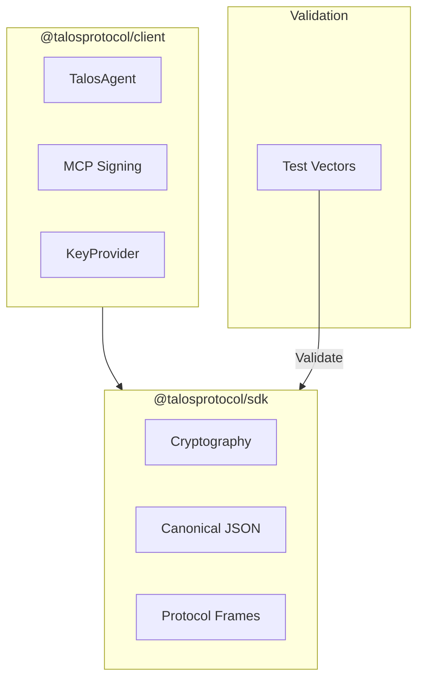

# Talos Protocol TypeScript SDK

> **Implementation-Safe, Interop-Safe, V1 Canonical SDK**

[](https://www.typescriptlang.org/)
[](https://nodejs.org/)
[](https://opensource.org/licenses/MIT)

## Abstract

This monorepo contains the TypeScript implementation of the Talos Protocol v1, providing cryptographic primitives and high-level client APIs for building secure AI agent applications in browser and Node.js environments.

---

## Packages

| Package                                    | Description                                      | Version |
| ------------------------------------------ | ------------------------------------------------ | ------- |
| [`@talosprotocol/sdk`](packages/sdk)       | Core primitives (Crypto, Canonical JSON, Frames) | v0.1.0  |
| [`@talosprotocol/client`](packages/client) | High-level Identity Agent & Transport            | v0.1.0  |

---

## Architecture



---

## Installation

```bash
npm install @talosprotocol/client @talosprotocol/sdk
```

---

## Quick Example

```typescript
import {
  TalosAgent,
  InMemoryKeyProvider,
  signMcpRequest,
} from "@talosprotocol/client";

// Initialize agent with DID
const agent = new TalosAgent("did:key:z6Mk...", new InMemoryKeyProvider());

// Sign an MCP request with audit bindings
const signedFrame = await signMcpRequest(
  agent,
  request,
  "session-123",
  "correlation-456",
  "filesystem",
  "read",
);
```

---

## Features

| Feature                 | Description                                         |
| ----------------------- | --------------------------------------------------- |
| **Ed25519 Signing**     | Deterministic signatures for auditability           |
| **X25519 Key Exchange** | Secure key derivation                               |
| **Canonical JSON**      | Reproducible serialization for hashing              |
| **DID:key Support**     | W3C DID standard                                    |
| **MCP Signing**         | Sign MCP requests with session/correlation bindings |
| **Vector Compliance**   | Validated against Python implementation             |

---

## Development

```bash
# Install dependencies
npm install

# Build all packages
npm run build

# Run tests (including vector compliance)
npm test

# Run E2E example
npm run example:e2e -w @talosprotocol/client
```

---

## Vector Compliance

The SDK is validated against test vectors from the canonical Python implementation, ensuring cross-language interoperability:

```bash
# Fetch latest test vectors
./scripts/fetch_vectors.sh

# Run vector tests
npm test
```

---

## Documentation

- **[SDK Reference](docs/wiki/SDK-Reference.md)** - Core SDK API
- **[Client Reference](docs/wiki/Client-Reference.md)** - Client API
- **[Architecture](docs/wiki/Architecture.md)** - Package structure

---

## Related

- [Talos Protocol](https://github.com/talosprotocol/talos) - Core Python implementation
- [MCP Cookbook](https://github.com/talosprotocol/talos/wiki/MCP-Cookbook) - Integration guide

---

## License

MIT License - See [LICENSE](LICENSE)
