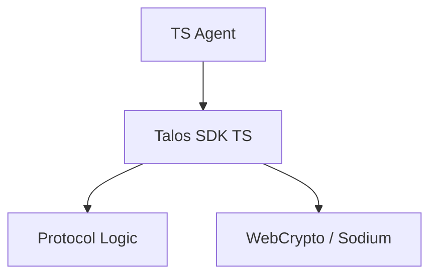

# Talos SDK for TypeScript

**Repo Role**: Official TypeScript/Node.js implementation of the Talos Protocol.

## Abstract

The Talos SDK for TypeScript brings secure, autonomous messaging to the JavaScript ecosystem. It provides a robust implementation of the Double Ratchet Algorithm, enabling Node.js agents and web-based clients to communicate securely over the Model Context Protocol (MCP).

## Introduction

JavaScript is the lingua franca of many agent frameworks. `talos-sdk-ts` ensures that these agents can participate in the Talos secure mesh with the same security guarantees as their system-level counterparts, managing identity keys and session lifecycles automatically.

## System Architecture


```mermaid
graph TD
    Agent[TS Agent] --> SDK[Talos SDK TS]
    SDK --> Core[Protocol Logic]
    SDK --> Crypto[WebCrypto / Sodium]
```

This SDK is a peer to the Python, Java, and Go implementations.

## Technical Design

### Modules

- **src/core**: Ratchet and Session management.
- **src/encoding**: Base64URL and binary utilities.
- **src/crypto**: Cryptographic wrappers.

### Data Formats

- **Input**: MCP JSON-RPC objects.
- **Output**: JSON Web Encryption (JWE) compatible structure.

## Evaluation

**Status**: ✅ STABILIZED (v4.0.0-alpha)

- **Conformance**: 100% pass rate on `v1.1.0` release set.
- **Interop**: Fully verified against Python and Java SDKs.
- **Coverage**: >80% for both `@talosprotocol/sdk` and `@talosprotocol/client`.

## Usage

### Quickstart

```bash
npm install @talos/sdk
```

### Common Workflows

1. **Create Identity**:

   ```typescript
   const id = await Identity.generate();
   ```

## Operational Interface

- `make test`: Run Vitest suite.
- `make conformance`: Run vector validation.
- `scripts/test.sh`: CI entrypoint.

## Security Considerations

- **Threat Model**: XSS in web contexts, compromised dependencies.
- **Guarantees**:
  - **Isolation**: Keys handled within isolated memory where possible.

## References

1. [Mathematical Security Proof](../talos-docs/Mathematical_Security_Proof.md)
2. [Talos Contracts](../talos-contracts/README.md)
3. [JWE Specification](https://datatracker.ietf.org/doc/html/rfc7516)
4. [Talos Wiki](https://github.com/talosprotocol/talos/wiki)

## License

Licensed under the Apache License 2.0. See [LICENSE](LICENSE).
