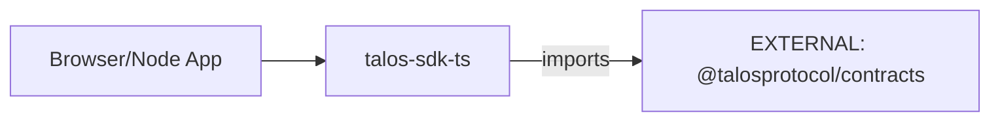

# talos-sdk-ts Architecture

## Overview
`talos-sdk-ts` provides the TypeScript SDK for browser and Node.js environments.

## Internal Components

| Component | Purpose |
|-----------|---------|
| `packages/sdk/` | Core SDK package |
| `packages/types/` | Shared TypeScript types |

## External Dependencies

| Dependency | Type | Usage |
|------------|------|-------|
| `[EXTERNAL]` @talosprotocol/contracts | NPM | Cursor, Base64url, schemas |

## Contracts Used

| Artifact | Version |
|----------|---------|
| `deriveCursor` | @talosprotocol/contracts@^1.0 |
| `decodeCursor` | @talosprotocol/contracts@^1.0 |
| `base64urlEncode` | @talosprotocol/contracts@^1.0 |
| `base64urlDecode` | @talosprotocol/contracts@^1.0 |

## Boundary Rules
- ✅ Re-export from contracts, never reimplement
- ❌ No `btoa`/`atob` usage (use contracts base64url)
- ✅ All types must align with contract schemas

## Data Flow

