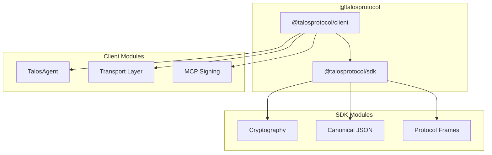
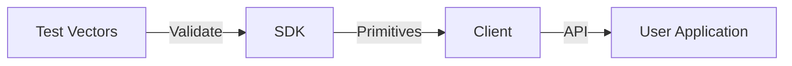

# Architecture

## Overview

The Talos TypeScript SDK is a monorepo containing two packages for building Talos-compatible applications.

## Package Structure

## Dependency Flow

## Packages

### @talosprotocol/sdk

Core cryptographic primitives and protocol utilities:

| Module   | Description                          |
| -------- | ------------------------------------ |
| `crypto` | Ed25519 signing, X25519 key exchange |
| `json`   | Canonical JSON serialization         |
| `frames` | Protocol frame encoding/decoding     |
| `did`    | DID:key utilities                    |

### @talosprotocol/client

High-level client for building Talos agents:

| Module                | Description                           |
| --------------------- | ------------------------------------- |
| `TalosAgent`          | Identity and key management           |
| `signMcpRequest`      | Sign MCP requests with audit bindings |
| `InMemoryKeyProvider` | Development key storage               |

## Vector Compliance

Both packages are validated against the canonical `test_vectors/` from the Python implementation, ensuring cross-language interoperability.
